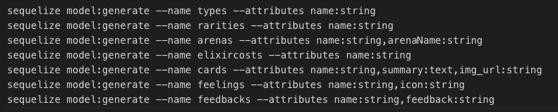
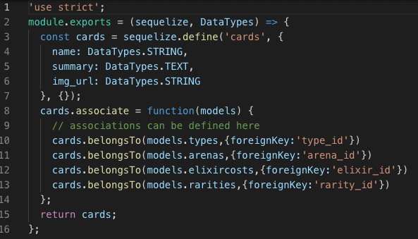
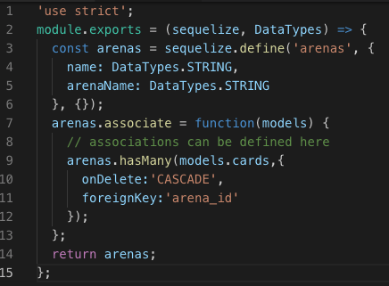

# CLASH ROYALE COMMUNITY

This is my first full stack project at DigitalCrafts and one of my favorite project. The main purpose of this project is to learn Node.js and Express. I got an inspiration from my son. His friends and he often talks about this game.I decided to make something that we both can enjoy and I want to provide a place that they can chat online safely.

<a href='#'>Live Site </a>

 
<h3> Target </h3>
This website is for the people who started playing clash royale game and who wants to chat with fellow players.

## What I used
<ul>
<li>HTML</li>
<li>CSS</li>
<li>JavaScript</li>
<li>JSON</li>
<li>Bootstrap 4</li>
<li>jQuery</li>
<li>ajax</li>
<li>Node.js</li>
<li>Express</li>
<li>PostgreSQL</li>
<li>Sequelize</li>

## Features
* Watch youTube video
* View cards available on Clash Royale by Type, Rarity, Arena
* Search Card
* Feedback 
* Chat with your friends

## Screenshots
<h4>Index Page: Watch youTube and links for game communities</h4>

<h4>Card Page: Able to check all cards by Type, Rarity, Arena</h4>

<h4>Feedback Page: Feedback datas are stored into database</h4>

<h4>Chat Page: Chat with anyone who is connected to the page.</h4>

<h4>Search Bar: Able to search card by name</h4>

## My Challenge
My biggest challenge for this site was Sequelize. Although I have previous experience on SQL, ORM Sequelize was new to me. After trying few times creating models, I was able to understand better on how we define models. 
For the querying part, I found it was much easier to write SQL first to get clear understanding on results, and then work on Sequelize.

## My Note on Sequelize
 <ol>
<li>sequelize init</li>

this will create following folders 

|- conig

     |- config.json // set up database information /sql light, postgres, mySQL

|- models

|- migrations

<li>Run bash files(if any)</li>

<li>create models</li>

This is database model and needs to be completed before set up database. 

This part should define columns besides foreign keys. If you are using migration files, which will be easier when deploying, do not forget to define foreign key columns in migration files. If you are using .sync, then just defining relations in model files are suffice.

 

<li>sync / db:migrate</li>
There are 2 ways to create database

[1] .sync
This method is easier when creating tables and columns based on models. Define models and sync it in js file. If you set {force:true}, this will overwrite tables if exists. Therefore it would be safer to set {force:false}.

<code>

// db.sequelize.sync({force:true}).then();

</code>

<li>Join</li>

Specify in ininclude. If you want to inner join, specify "required:true". It will be left outer join without it.

