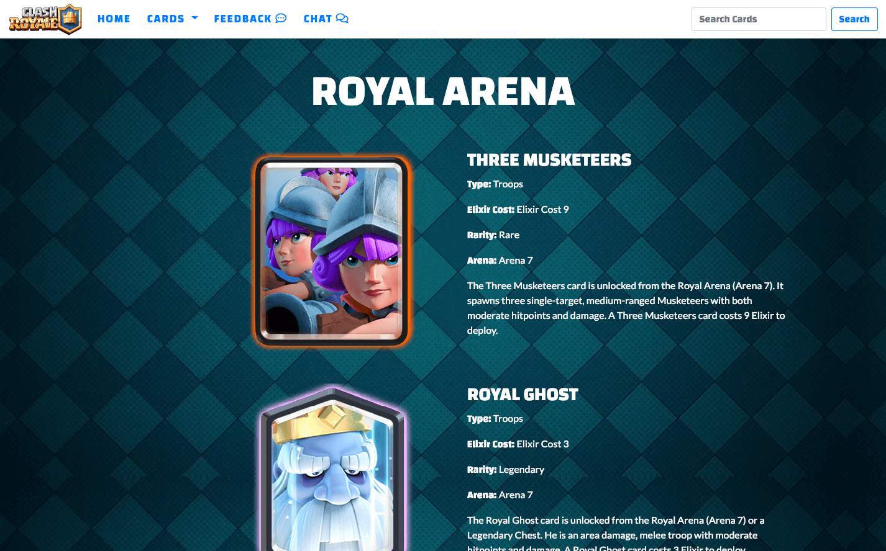

# CLASH ROYALE COMMUNITY

<a href='https://crcommunity.herokuapp.com/'>Click Here for Live Site </a>
 
 

This is my first full stack project at DigitalCrafts and one of my favorite project. The main purpose of this project is to learn Node.js and Express. I got an inspiration from my son. His friends and he often talks about this game.I decided to make something that we both can enjoy and I want to provide a place that they can chat online safely.

 
<h3> Target </h3>
This website is for the people who started playing clash royale game and who wants to chat with fellow players.

## What I used
<ul>
<li>HTML</li>
<li>CSS</li>
<li>JavaScript</li>
<li>JSON</li>
<li>Bootstrap 4</li>
<li>jQuery</li>
<li>Ajax</li>
<li>Node.js</li>
<li>Express</li>
<li>PostgreSQL</li>
<li>Sequelize</li>

## Features
* Watch youTube video
* View cards available on Clash Royale by Type, Rarity, Arena
* Search Card
* Feedback 
* Chat with your friends

## Screenshots
<h4>Index Page: Watch youTube and links for game communities</h4>

<h4>Card Page: Able to check all cards by Type, Rarity, Arena</h4>

<h4>Feedback Page: Feedback datas are stored into database</h4>

<h4>Search Bar: Able to search card by name</h4>

## My Challenges
My biggest challenge for this site was Sequelize. Although I have previous experience on SQL, ORM Sequelize was new to me. After trying few times creating models, I was able to understand better on how we define models. 
For the querying part, I found it was much easier to write SQL first to get clear understanding on results, and then work on Sequelize.

## My Note on Sequelize
 <ol>
<li>sequelize init</li>
this will create following folders  
 |- conig 
      |- config.json // set up database information /sql light, postgres, mySQL 
|- models        
|- migrations 

<li>create models</li>
This is database model and needs to be completed before set up database.  
// this part should define columns besides foreign keys
<code>
const arenas = sequelize.define('arenas', { 
    name: DataTypes.STRING, 
    arenaName: DataTypes.STRING 
  }, {}); 
// This area should define foreign keys 
    arenas.associate = function(models) { 
    // associations can be defined here 
    arenas.hasMany(models.cards,{ 
      onDelete:'CASCADE', 
      foreignKey:'arena_id' 
    }); 
  }; 
</code>

<li>sync / db:migrate</li>
There are 2 ways to create database 
 
// crate tables force:true will overwrite tables if exists 
// db.sequelize.sync({force:true}).then(()=>{ 
//     app.listen(3500) 
// }) 
 
<li>JOIN</li>
Specify include 
<code>
include: [ 
        {model:db.types,required:true} 
        , { model:db.rarities,requiredx:true} 
        , { model:db.arenas,required:true} 
        , { model:db.elixircosts, required:true 
        }] 
,where: { 
        name: {[Sequelize.Op.iLike]: `%${searchID}%`} 
        } 
</code>

